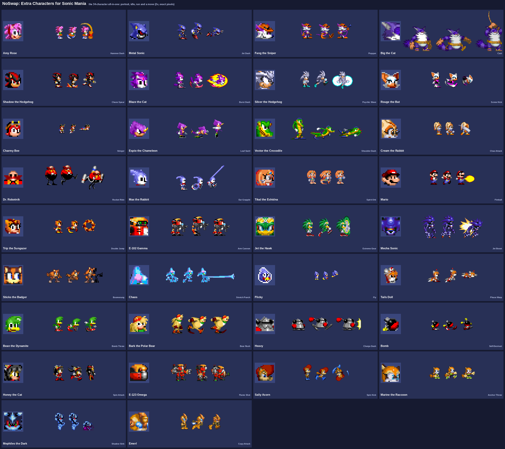
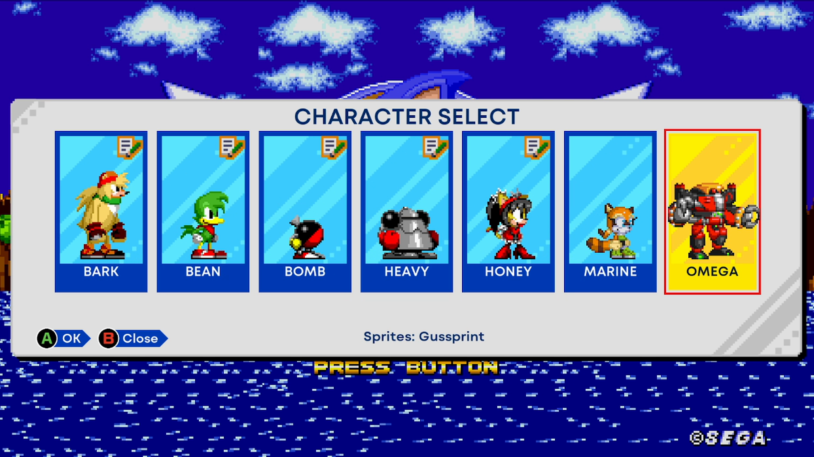
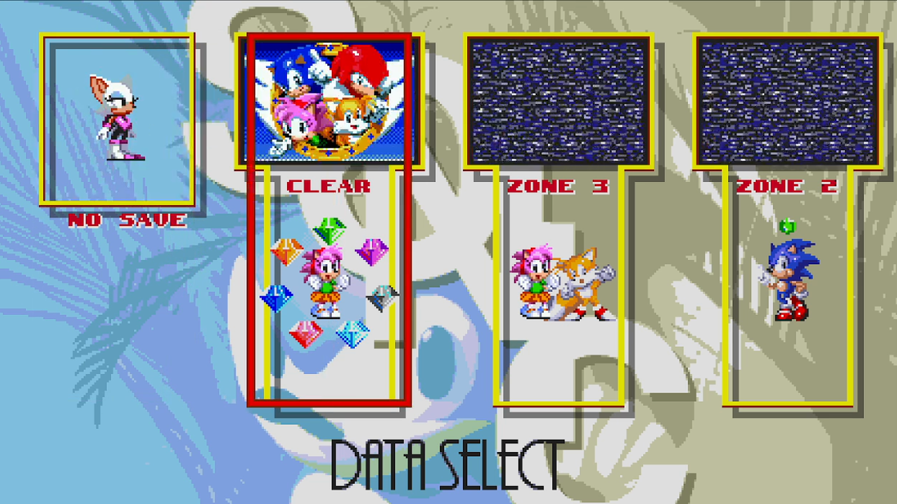
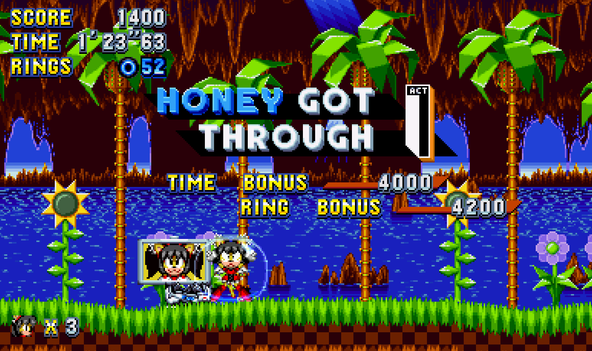
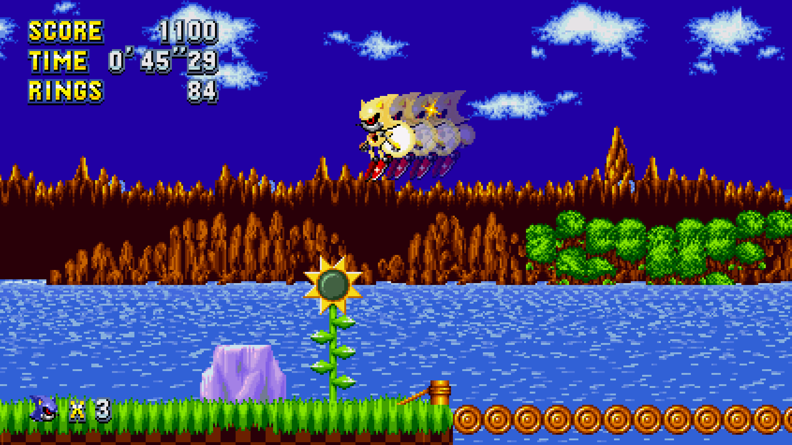
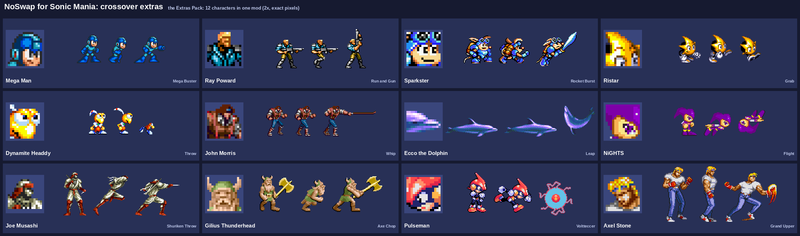

# NoSwap: Extra Characters for Sonic Origins and Sonic Mania
[](https://youtu.be/mTsP9Xk0ZI8)

NoSwap adds new playable characters to the classic games in **Sonic Origins** (Sonic 1, Sonic 2, Sonic CD and
Sonic 3 & Knuckles) and to **Sonic Mania** (through the Sonic Mania decompilation), **without replacing anyone**.
Sonic, Tails, Knuckles and Amy stay as they are; the new characters get their own cards in Origins' character select,
their own save slots and their own moves, built from fan sprite sheets by the artists credited below.

It has 35 Sonic characters (Metal Sonic, Shadow, Blaze, Silver, Rouge, Espio, Big, Sticks, Chaos, Tails Doll and many
more), an Extras Pack of 12 guests from other games (Mega Man, Ristar, NiGHTS, Pulseman, Joe Musashi...), a Mania mod,
and **Mania Lock-On**, a SONIC MANIA button in Origins' main menu that starts your own copy of the Mania decompilation.

Curious how the extra character cards work? The research is documented on HedgeDocs:
[Sonic Origins Character Select](https://hedgedocs.com/index.php/Sonic_Origins_Character_Select).



## Download and play

**Players don't need this repository.** Everything is ready to install on the
[Releases page](https://github.com/superevil6/sonic-noswap/releases/latest). Pick the game below and follow its steps.
It looks like a lot written out, but it's a few minutes the first time.

### Sonic Origins (Steam)



**You need:** Sonic Origins on Steam (PC), and [HedgeModManager](https://github.com/hedge-dev/HedgeModManager)
(version 8 or newer), the usual mod manager for Origins.

1. **Set up HedgeModManager** if you haven't: download it, open it, and pick Sonic Origins when it asks for your game.
2. From the [Releases page](https://github.com/superevil6/sonic-noswap/releases/latest), download:
   - **`NoSwap-AllInOne-<version>.zip`**: the mod with all 35 Sonic characters (required).
   - **`NoSwap-Extras-<version>.zip`**: the 12 guest characters (optional).
3. In HedgeModManager, click **Install Mod** (or drag a zip onto its window) and pick each zip you downloaded.
4. **Tick** "NoSwap: Extra Characters" (and "NoSwap: Extras Pack"), then click **Save & Play**.
5. **Playing:**
   - **Sonic 1, Sonic 2 and Sonic CD:** the extras are in the character select, after the usual cards. Scroll right to
     see them all.
   - **Sonic 3 & Knuckles:** on the save screen, press **up/down** on a save slot to choose its character.



**Good to know**
- **Not compatible with Sonic Origins Ultrafix (yet):** untick Ultrafix while playing NoSwap. Other mods that change
  the menus or the player can clash the same way.
- **If the extra cards are empty or everyone plays as Sonic,** another mod is overriding NoSwap's files: untick it, or
  move NoSwap above it in HedgeModManager's list. NoSwap shows a message box when it detects this, and writes details
  to `NoSwapS3K.log` in its mod folder.
- Origins' own save file is never touched; the extras save to their own file.
- Optional: **`ManiaLockOn-<version>.zip`** adds a SONIC MANIA button to Origins' main menu that starts your Sonic Mania
  decompilation (see below). Install and tick it the same way.

### Sonic Mania (the decompilation)



NoSwap for Mania runs on the **Sonic Mania decompilation**, a free fan-made version of Mania's engine that loads mods.
**It does not work with the normal Steam executable,** but the decompilation uses your Steam copy's game data, so you
only need to own Mania.

**You need:** Sonic Mania on Steam (PC).

1. **Get the decompilation** (official releases, both by RSDKModding):
   - the engine, from [RSDKv5-Decompilation releases](https://github.com/RSDKModding/RSDKv5-Decompilation/releases):
     `v5-windows-x64.zip`, take **`RSDKv5U.exe`**;
   - the game code, from [Sonic-Mania-Decompilation releases](https://github.com/RSDKModding/Sonic-Mania-Decompilation/releases):
     `mania-windows-x64.zip`, take **`v5U/Game.dll`**.
2. Put **`RSDKv5U.exe`** and **`Game.dll`** in your Sonic Mania folder, next to **`Data.rsdk`** (in Steam: right-click
   Sonic Mania > Manage > Browse local files). Double-click `RSDKv5U.exe` once to check it runs, then close it.
3. **Install the mods**, either way:
   - **With the [RSDK Mod Manager](https://gamebanana.com/tools/10457)** (easiest): put it in the same folder, open
     it, install **`NoSwapMania-<version>.zip`** (and optionally **`NoSwapMania-Extras-<version>.zip`**), tick them,
     and click **Save & Play**.
   - **By hand:** make a folder called **`mods`** next to `RSDKv5U.exe`, unzip the zips into it (you should end up
     with `mods/NoSwapMania/mod.ini`), then create a text file **`mods/modconfig.ini`** containing:
     ```
     [Mods]
     NoSwapMania=y
     NoSwapMania-Extras=y
     ```
4. **Playing:** start `RSDKv5U.exe`, choose **Mania Mode**, and on the save select press **up/down** on "No Save" or a
   new save slot to cycle through the characters.



**Good to know**
- The official decompilation releases have the Plus content switched off (no Mighty, Ray or Encore). NoSwap works
  either way.
- Tested with the official v1.1.1 releases.

### The Extras Pack



Twelve guests from other classic games: Mega Man, Ray Poward, Sparkster, Ristar, Dynamite Headdy, John Morris, Ecco the
Dolphin, NiGHTS, Joe Musashi, Gilius Thunderhead, Pulseman and Axel Stone. Install the Extras Pack **next to** the main
mod (same version) for either game. Each one is also on the Releases page on its own, if you only want one.

## About this repository

This repository is the source: the build tools, the Origins DLL, the Mania mod, the character configs and the docs. It
contains **no game files and no sprite sheets or sounds**. Everything the build needs from the games is taken from your
own copies, and every sheet is downloaded from its artist's page.

## Building it yourself

### What you need

- **Sonic Origins** (Steam) with **HedgeModManager** set up for it. The build reads the game's data packs and the
  Sonic 1/2/CD scripts HedgeModManager decompiles into the game folder (`build/main/projects/exec/Sonic1u/Scripts`...).
- **Sonic Mania** (Steam), only for the Mania mod. To play it you also need a build of the
  [Sonic Mania decompilation](https://github.com/RSDKModding/Sonic-Mania-Decompilation) (the official releases work).
- **Python 3** (developed with 3.13 and 3.14) with **Pillow**, **NumPy** and **SciPy**: `pip install pillow numpy scipy`.
  For the character editor's own window, also `pip install pywebview` (without it the editor opens in your browser).
- **MinGW-w64** (`x86_64-w64-mingw32-gcc` / `g++`) for the Origins DLL and Mania Lock-On.
- For the Mania mod: **CMake**, **gcc** and a checkout of
  [RSDKv5-GameAPI](https://github.com/RSDKModding/RSDKv5-GameAPI) (`GAMEAPI_DIR`).
- Optional: `vgmstream-cli` (tools/origins_sfx.py: Amy's hammer sounds for Mania, from Origins' sound banks).

The scripts are bash; on Windows, use WSL or MSYS2. Development happened on Linux, with the games under Proton.

### Steps

```sh
git clone https://github.com/superevil6/sonic-noswap.git
cd sonic-noswap

# 1. Take what the build needs from your own games (read only) into extracted/ (git-ignored).
#    It also cuts Mania's spin ball into testmods/_shared/. --mania is optional.
NOSWAP_KIT_DATA="$PWD" python3 tools/noswap.py setup \
    --origins "/path/to/steamapps/common/SonicOrigins" \
    --mania "/path/to/steamapps/common/Sonic Mania"

# 2. Tell the builders where the game is (the defaults are Steam's usual Linux folder)
export ORIGINS_GAME="/path/to/steamapps/common/SonicOrigins"
export ORIGINS_EXEC="$ORIGINS_GAME/build/main/projects/exec"
export NOSWAP_MANIA_DATA="$PWD/extracted/Mania/Data"

# 3. Download the sprite sheets (testmods/SHEETS.md: every sheet's page and the file name to save it as)
#    and Rayan C.'s HUD font (testmods/_fonts/SOURCE.txt). Then write the characters' configs:
python3 tools/write_configs.py

# 4. Build the art, then everything for Origins (scripts, packages, menu archives, the DLL, Mania Lock-On)
python3 tools/build_art.py
bash tools/build_all.sh

# 5. Sonic Mania (optional)
python3 tools/build_mania_art.py
GAMEAPI_DIR=/path/to/RSDKv5-GameAPI bash native/mania/build.sh
```

The output is in `mods/` (NoSwap, NoSwapMania, ManiaLockOn). `python3 tools/noswap.py deploy` (or `tools/deploy.sh`
with `GAME_MODS` set) copies it into the game's mods folder; `tools/make_release.py` packs release zips into `dist/`.
`native/build.sh` alone rebuilds only the Origins DLL; `native/fetch_deps.sh` re-fetches the third-party code in
`native/third_party/` if you delete it.

A character whose sheet you haven't downloaded makes `write_configs.py` fail for that character. To leave one out,
delete its `testmods/<name>/` folder from your checkout; the others still build.

## Making a character

Characters are data: a sprite sheet plus a `character.json` (or an older `make_configs.py`) in `testmods/<name>/`.
A character that only uses existing moves needs no code change at all.

- [docs/character-json.md](docs/character-json.md): the format, field by field, with the schema in
  [docs/character.schema.json](docs/character.schema.json). `testmods/bean/` and `testmods/nights/` are good examples.
- [docs/abilities.md](docs/abilities.md): every move and passive you can give a character, which games support it and
  its settings (`python3 tools/noswap.py abilities` lists them too).
- [docs/toolset-cli.md](docs/toolset-cli.md): `noswap check | preview | build | convert | deploy`.
- [docs/toolset-ui.md](docs/toolset-ui.md): the character editor (`python3 tools/noswap.py ui`), with frame boxes,
  animations, abilities, palette, hit boxes and a live check.
- The **Creator Kit** on the Releases page is the same editor and build as a program, for people who don't want a
  repository or Python. `tools/make_kit.py` packs it.

Give your character a key of your own (`"key": "<you>.<character>"`): it gets a fresh number in `data/registry.json`
the first time it's built. Numbers are never reused, so saves don't mix.

Art rules NoSwap follows, and asks contributors to follow: use sheets whose terms allow it, credit the artists, and
only crop, flip, rotate by 90 degrees or enlarge by whole numbers with nearest-neighbour. Never redraw, recolour or
smooth someone else's sprites, and never commit a sheet to this repository.

## Adding a new ability

A new move is core work: it has to be written once per engine. The four engines are:

| Game | Engine | Where moves live |
|---|---|---|
| Sonic 1, Sonic 2 | Retro Engine v4 scripts | generated into `Players/PlayerObject.txt` by `tools/abilities.py` (`ABILITIES`, `apply_*`) or a move module's `v4_patch` |
| Sonic CD | Retro Engine v3 scripts | `tools/build_soniccd.py`, or a move module's `cd_patch` |
| Sonic 3 & Knuckles | native, the Origins DLL | `native/src/` (e.g. `Voltteccer.h`), included and called from `native/src/NoSwapS3K.cpp` |
| Sonic Mania | native, the decomp mod | `native/mania/src/` (e.g. `ManiaVoltteccer.h`), wired in `native/mania/src/NoSwapMania.c` |

The newer moves follow one pattern; copy one of them (`tools/voltteccer.py` with `native/src/Voltteccer.h` and
`native/mania/src/ManiaVoltteccer.h` is a complete, self-contained example):

1. **Design it once** in the module's docstring: the input, the states, the numbers, the animation slots it uses.
2. **Sonic 1/2:** write `v4_patch(text)` in `tools/<move>.py` and chain it in `tools/abilities.py` (the
   `v4_patch` chain near the end). Per-character state goes in spare player values (`tools/noswap_common.py`).
3. **Sonic CD:** write `cd_patch(text)` and chain it in `tools/build_soniccd.py`.
4. **Sonic 3 & Knuckles:** add the move's fields to the package data with `s3k_fields()`, referenced from
   `tools/gen_s3k_header.py` (which generates the field table the DLL reads from each package's
   `noswap_character.json`), then write the runtime in `native/src/<Move>.h` and call it from `NoSwapS3K.cpp`.
5. **Sonic Mania:** the same fields are read from the Mania package; write `native/mania/src/Mania<Move>.h` and add it
   to `NoSwapMania.c`. A game the move doesn't support can be left out: the registry marks it per game.
6. **Animation slots:** reuse the shared per-kind slots (41 and up: `cd_config.ABILITY_SLOTS`, `build_s3k_art.py`).
7. **Describe it** for creators in `tools/abilities_text.py`, then run `python3 tools/abilities_registry.py --write`.
   It works out per-game support from the code and regenerates `docs/abilities.{json,md}`; `--check` (also run by
   `tools/make_kit.py`) fails when a move or field isn't described.
8. **Prove it:** build everything, and check that characters without the move build byte-identical outputs before
   and after (hash `mods/` first). Test it in all the games it claims.

## About AI use

NoSwap was made with heavy AI assistance, and we want to be plain about it.

- **The code and the reverse engineering** (the build tools, the script generators, the Origins DLL and its hooks, the
  Sonic Origins character select and menu card research, the Mania mod, the docs) were written with heavy assistance
  from an AI, Claude (by Anthropic). Superevil directed and designed the project and its characters' moves, made the
  calls, and tested everything in the games. The reverse engineering in particular was AI work, not Superevil's own.
  The character select research is also published, with the same disclosure, on HedgeDocs:
  [Sonic Origins Character Select](https://hedgedocs.com/index.php/Sonic_Origins_Character_Select)
  (a copy is in [docs/origins-character-select.wiki](docs/origins-character-select.wiki) and
  [.md](docs/origins-character-select.md)).
- **The sprites are not AI.** Every character is drawn by the human artists credited below, used as their sheets allow.
- It builds on a lot of community work, credited below, which made it possible at all.

## Credits

The full list, with every sheet's page, is in [CREDITS.md](CREDITS.md). In short: the sprite artists (Akimaca,
deltaConduit, Gardow, Xeric, Madz and Selphy Geumja, and many more), the sound rippers on The Sounds Resource, Rayan C.
for the HUD font, the Sonic Mania / RSDK decompilation by Rubberduckycooly and chuliRMG (original RSDK by Evening Star),
HedgeModManager and HiteModLoader by hedge-dev, MinHook by Tsuda Kageyu, thesupersonic16's Origins mods (Ultrafix's
headers were the reference for many S3&K types), HedgeLib and the Origins modding community.

Sonic the Hedgehog, Sonic Origins, Sonic Mania and their characters are (c) SEGA. The guest characters belong to their
owners (see CREDITS.md). NoSwap is an unofficial, non-commercial fan project, not affiliated with or endorsed by SEGA
or anyone else.

## Licence

NoSwap's own code and docs are under **Creative Commons Attribution-NonCommercial-ShareAlike 4.0** ([LICENSE](LICENSE)):
you may use, change and share them for **non-commercial** purposes, as long as you **credit** NoSwap (Superevil,
github.com/superevil6/sonic-noswap) and share your changes under the same licence. See [NOTICE.md](NOTICE.md) for what
else applies:

- `native/mania/` and `tools/rsdk5_extract.py` build on the RSDKv5 / Sonic Mania decompilations and are also under
  their licences ([native/mania/LICENSE-DECOMP.md](native/mania/LICENSE-DECOMP.md)): non-commercial, credit the
  decompilation's authors, no game assets.
- `native/third_party/` keeps its own licences (MinHook: BSD 2-Clause; HiteModLoader headers and the reference headers
  from thesupersonic16's DllMods: MIT).
- Sprite sheets and sounds are **not** covered by this licence: they belong to their artists (and the games' owners)
  and aren't in this repository.
